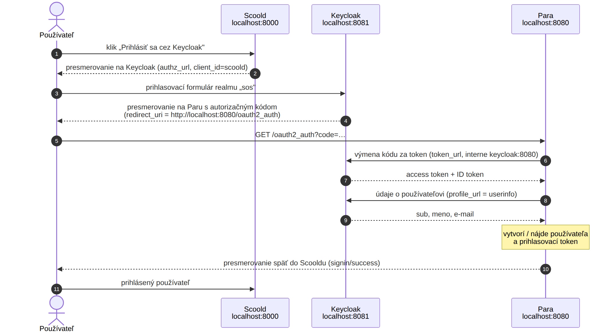
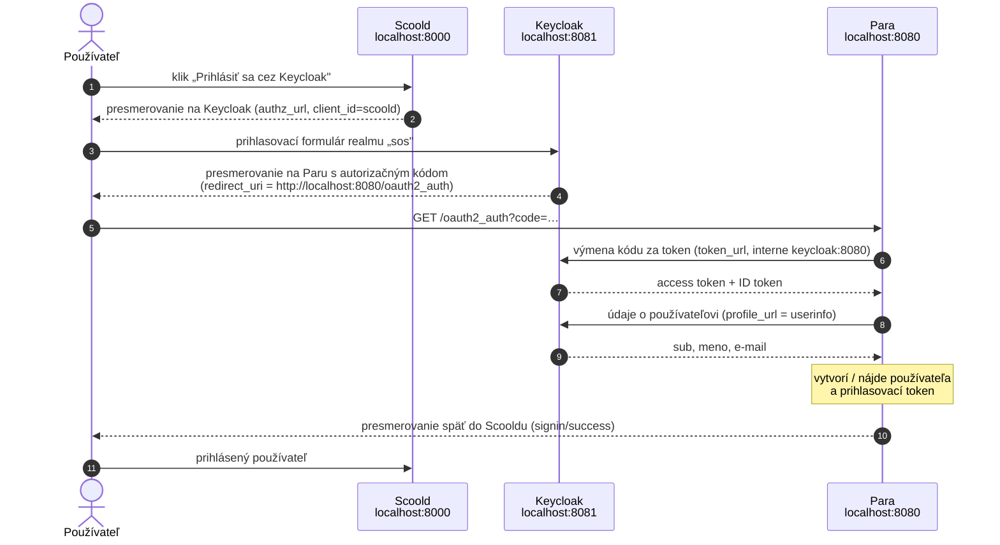

# Prihlasovanie cez Keycloak (OpenID Connect)

Tento dokument popisuje, ako sa do fóra Platformy SOS (Scoold) prihlasuje cez Keycloak,
ako je Keycloak nastavený lokálne, akí sú testovací používatelia a čo treba zmeniť pre produkciu.

## Prehľad

- Scoold používa **všeobecné OAuth 2.0 / OpenID Connect prihlásenie**, ktoré je súčasťou open-source verzie.
  Scoold Pro netreba.
- Samotnú výmenu tokenov nerobí Scoold, ale jeho backend **Para**. Scoold len presmeruje prehliadač
  na Keycloak a po úspešnom prihlásení dostane od Pary hotového používateľa.
- Na prihlasovacej stránke je hlavné tlačidlo **„Prihlásiť sa cez Keycloak"**. Prihlásenie heslom ostáva
  v sekcii „Iné spôsoby prihlásenia" (dá sa vypnúť).

## Architektúra



Obrázok je vygenerovaný z diagramu nižšie (Mermaid). Pri zmene toku upravte diagram a obrázok pregenerujte.



Dôležité adresy:

| Kto volá | Adresa | Prečo |
|---|---|---|
| prehliadač → Keycloak | `http://localhost:8081/realms/sos/...` | verejná adresa Keycloaku |
| Keycloak → prehliadač → Para | `http://localhost:8080/oauth2_auth` | Para musí byť dostupná z prehliadača (`scoold.security.redirect_uri`) |
| Para → Keycloak | `http://keycloak:8080/realms/sos/...` | interná adresa v Docker sieti (token + userinfo) |

Keycloak má nastavené `KC_HOSTNAME=http://localhost:8081` a `KC_HOSTNAME_BACKCHANNEL_DYNAMIC=true`.
Vďaka tomu je *issuer* tokenov vždy `http://localhost:8081/realms/sos`, aj keď Para volá Keycloak interne
cez `keycloak:8080`. Inak by userinfo odmietol token pre nezhodu issuera.

## Súbory

| Súbor | Obsah |
|---|---|
| `docker-compose.override.yml` | služba `keycloak` (Keycloak 26.3, `start-dev --import-realm`, port 8081) |
| `keycloak/sos-realm.json` | realm `sos`: klient, skupiny, testovací používatelia (importuje sa pri štarte) |
| `scoold-application.conf` | nastavenia OAuth v Scoolde (lokálne, necommitovať) |
| `scoold-application.conf.example` | vzor konfigurácie bez secretov (v gite) |

## Realm `sos`

- **Názov:** Platforma SOS, predvolený jazyk **slovenčina**, prihlásenie aj e-mailom, **registrácia vypnutá**
  (účty zakladá správca).
- **Klient `scoold`:**
  - dôverný klient (client secret), Authorization Code flow;
  - secret `scoold-dev-secret` – **len pre lokálny vývoj**;
  - redirect URI: `http://localhost:8080/oauth2_auth*` (Para);
  - web origin: `http://localhost:8000`, post-logout redirect: `http://localhost:8000/*`;
  - mapper `groups`: pridá skupiny používateľa do claimu `groups` (ID token, access token aj userinfo).

### Skupiny

| Skupina | Význam |
|---|---|
| `sos-admin` | správcovia platformy |
| `sos-moderator` | moderátori (napr. pracovníci rezortu, ktorí overujú odpovede) |
| `obce` | pracovníci obcí |
| `poskytovatelia` | poskytovatelia sociálnych služieb |
| `rezort` | pracovníci MPSVaR SR |

## Testovací používatelia

Heslá sú **len pre lokálny vývoj**. Účty sa vytvoria automaticky pri prvom štarte Keycloaku (import realmu).

| Prihlasovacie meno | Heslo | Meno | E-mail | Skupiny v Keycloaku | Rola v Scoolde |
|---|---|---|---|---|---|
| `admin.sos` | `admin` | Admin SOS | admin@sos.local | `sos-admin` | **správca** (skupina `sos-admin`) |
| `obec.test` | `test` | Jana Obecná | obec@sos.local | `obce` | bežný používateľ |
| `poskytovatel.test` | `test` | Peter Poskytovateľ | poskytovatel@sos.local | `poskytovatelia` | bežný používateľ |
| `rezort.test` | `test` | Mária Rezortná | rezort@sos.local | `rezort`, `sos-moderator` | **moderátor** (skupina `sos-moderator`) |

Administrátorská konzola Keycloaku: http://localhost:8081, prihlásenie `admin` / `admin`
(bootstrap admin, nie je to používateľ realmu `sos`).

### Roly: synchronizácia zo skupín Keycloaku

Scoold Pro nepoužívame, preto je mapovanie skupín na roly doplnené priamo vo forku
(`src/main/java/com/erudika/scoold/utils/KeycloakRoleSync.java`).

| Skupina v Keycloaku | Rola v Scoolde |
|---|---|
| `sos-admin` | správca (admins) |
| `sos-moderator` | moderátor (mods) |
| ostatné / žiadna | bežný používateľ (users) |

Ako to funguje:

1. Používateľ sa prihlási cez Keycloak. Para ho uloží s identifikátorom `oauth2:<sub>`
   (`sub` = ID používateľa v Keycloaku).
2. Scoold sa prihlási do Keycloaku ako **service account klienta `scoold`** (client credentials,
   rola `realm-management` → `view-users`).
3. Zavolá Admin REST API `GET /admin/realms/sos/users/<sub>/groups` a podľa skupín nastaví rolu.
4. Výsledok sa drží v pamäti `keycloak.role_sync_interval_sec` (300 s). Pri každom novom prihlásení
   sa skupiny načítajú hneď. Zmena skupiny v Keycloaku sa teda prejaví najneskôr do 5 minút.
   Odobratie zo skupiny rolu aj odoberie.
5. Ak je Keycloak nedostupný, ostáva posledná známa rola (nový pokus o minútu).

Poznámky:

- E-maily v `scoold.admins` sú správcami **vždy** (núdzový prístup, aj keď Keycloak nefunguje).
  Vo forku sa berú všetky e-maily zo zoznamu – pôvodná OSS verzia brala len prvý.
- Používatelia prihlásení heslom priamo v Scoolde (nie cez Keycloak) sa nesynchronizujú.
- Ručné nastavenie „moderátor" v profile sa pri ďalšej synchronizácii prepíše podľa Keycloaku.
  Roly spravujeme **len v Keycloaku**.
- Mapovanie skupín `obce`, `poskytovatelia`, `rezort` na Spaces zatiaľ nie je (dá sa doplniť rovnako).

Konfigurácia (`scoold-application.conf`):

```properties
scoold.keycloak.role_sync_enabled = true
scoold.keycloak.url = "http://keycloak:8080"      # adresa Keycloaku z pohľadu Scooldu
scoold.keycloak.realm = "sos"
scoold.keycloak.admin_group = "sos-admin"         # môže byť viac skupín oddelených čiarkou
scoold.keycloak.mod_group = "sos-moderator"
scoold.keycloak.role_sync_interval_sec = 300
# scoold.keycloak.client_id / client_secret – predvolene oa2_app_id / oa2_secret
```

Nastavenie v Keycloaku (v `sos-realm.json` už je, pri existujúcom realme treba ručne):

1. Admin konzola → realm `sos` → Clients → `scoold` → Settings → **Service accounts roles: On** → Save.
2. Záložka **Service accounts roles** → Assign role → filter „Filter by clients" → `realm-management`
   → `view-users` (a `query-groups`) → Assign.

Overenie: v logu Scooldu po prihlásení `role synced from Keycloak: users -> admins`
(`docker compose logs scoold | grep "synced from Keycloak"`).

## Odhlásenie (single logout)

Keycloak si pamätá prihlásenie vo vlastnej relácii (cookie na `localhost:8081`). Keby Scoold pri odhlásení
ukončil len svoju reláciu, ďalšie „Prihlásiť sa cez Keycloak" by prešlo **bez zadania hesla**.
Preto sa po odhlásení ukončí aj relácia v Keycloaku:

1. Tlačidlo „Odhlásiť sa" (menu profilu) pošle `POST /signout` a Scoold ukončí svoju reláciu.
2. Skript v `templates/idsk/layout.vm` potom presmeruje prehliadač na `scoold.signout_url`,
   teda na odhlasovací endpoint Keycloaku:

   ```properties
   scoold.signout_url = "http://localhost:8081/realms/sos/protocol/openid-connect/logout?client_id=scoold&post_logout_redirect_uri=http%3A%2F%2Flocalhost%3A8000%2Fsignin%3Fcode%3D5%26success%3Dtrue"
   ```

3. Keycloak zobrazí potvrdenie „Chcete sa odhlásiť?", ukončí reláciu a vráti používateľa na prihlasovaciu stránku fóra.
   Návratová adresa musí byť v povolených *post logout redirect URIs* klienta `scoold` (`http://localhost:8000/*`).

Poznámky:

- Presmerovanie robí skript, nie formulár. CSP Scooldu (`form-action 'self'`) by presmerovanie formulára
  na inú doménu zablokovala.
- Potvrdzovacia stránka sa zobrazí, lebo neposielame `id_token_hint`. Scoold (Para) ID token neukladá.
  Dá sa to zmeniť cez `security.oauth.token_delegation_enabled` a vlastnú úpravu.
- Používatelia prihlásení heslom priamo v Scoolde tiež prejdú cez odhlasovaciu stránku Keycloaku.
  Neuškodí to, len uvidia potvrdenie.
- V produkcii treba v `signout_url` zmeniť adresy na produkčné (https).

## Konfigurácia Scooldu

V `scoold-application.conf` (vzor v `scoold-application.conf.example`):

```properties
# prehliadač -> Keycloak (verejná adresa)
scoold.security.oauth.authz_url = "http://localhost:8081/realms/sos/protocol/openid-connect/auth"
# Para -> Keycloak (interná adresa v docker sieti)
scoold.security.oauth.token_url = "http://keycloak:8080/realms/sos/protocol/openid-connect/token"
scoold.security.oauth.profile_url = "http://keycloak:8080/realms/sos/protocol/openid-connect/userinfo"
scoold.oa2_app_id = "scoold"
scoold.oa2_secret = "scoold-dev-secret"
scoold.security.oauth.scope = "openid email profile"
scoold.security.oauth.parameters.id = "sub"
scoold.security.oauth.parameters.name = "name"
scoold.security.oauth.parameters.given_name = "given_name"
scoold.security.oauth.parameters.family_name = "family_name"
scoold.security.oauth.parameters.email = "email"
scoold.security.oauth.download_avatars = false
scoold.security.oauth.provider = "Prihlásiť sa cez Keycloak"
# Keycloak presmeruje prehliadač späť na Paru (musí byť dostupná z prehliadača)
scoold.security.redirect_uri = "http://localhost:8080"
# správcovia (podľa e-mailu)
scoold.admins = "Mykola.Honcharenko@posam.sk,admin@sos.local"
```

Scoold pri štarte odovzdá tieto nastavenia Pare. Po zmene treba reštartovať Scoold:
`docker compose restart scoold`.

## Spustenie a test

```bash
docker compose up -d keycloak
docker compose restart scoold
```

1. Počkajte ~30–40 s (Scoold čaká na Paru) a otvorte http://localhost:8000/signin.
2. Kliknite na **„Prihlásiť sa cez Keycloak"**.
3. Prihláste sa napr. ako `obec.test` / `test`.
4. Po návrate do fóra vpravo hore vidíte iniciály (JO) a v profile meno a e-mail z Keycloaku.
5. Odhláste sa a prihláste ako `admin.sos` / `admin`. V menu profilu musí byť „Správa".

Overenie Keycloaku samostatne:

```bash
curl -s http://localhost:8081/realms/sos/.well-known/openid-configuration | python3 -m json.tool | head -20
```

`issuer` musí byť `http://localhost:8081/realms/sos`.
