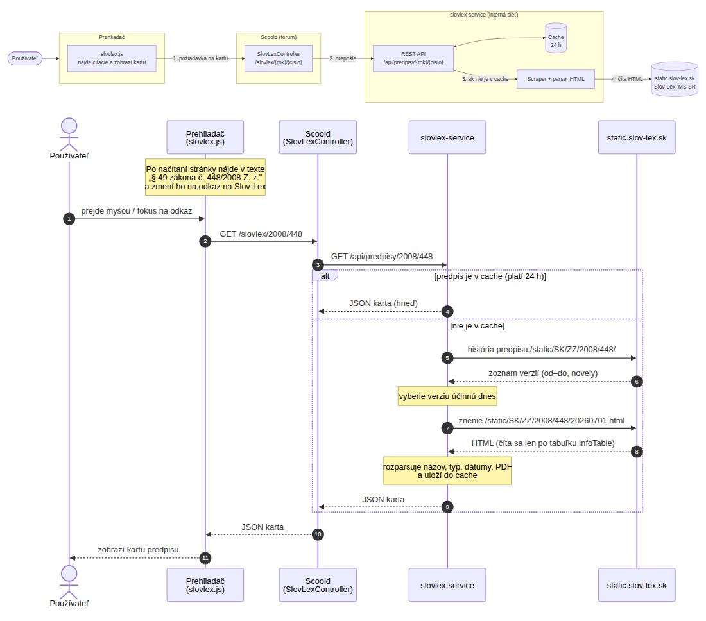
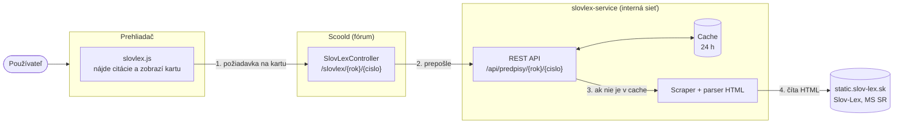
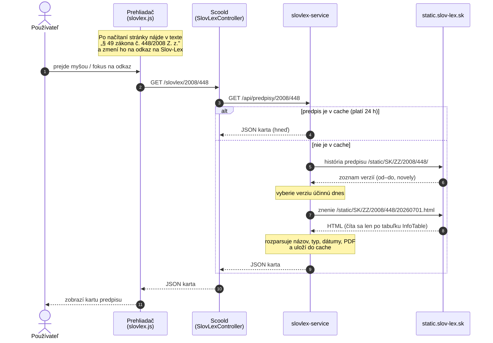

# Slov-Lex vo fóre Platformy SOS

Tento dokument popisuje, ako fórum (Scoold) prepája citácie právnych predpisov s portálom
[Slov-Lex](https://www.slov-lex.sk) (Ministerstvo spravodlivosti SR), ako to spustiť, otestovať a udržiavať.

## Čo to robí

- V otázkach, odpovediach a komentároch sa citácie predpisov (napr. „§ 49 zákona č. 448/2008 Z. z.")
  automaticky zmenia na **odkazy na Slov-Lex**.
- Pri prechode myšou alebo fokuse klávesnicou sa zobrazí **karta predpisu**:
  - názov a typ predpisu;
  - znenie účinné dnes (od–do) a posledná novela;
  - odkaz na citovaný paragraf v účinnom znení, na Slov-Lex a na právne záväzné PDF.

Slov-Lex **nemá verejné API**, preto údaje čítame z HTML statickej verzie portálu (`static.slov-lex.sk`).

## Architektúra



Obrázok je vygenerovaný z diagramov nižšie (Mermaid). Pri zmene architektúry upravte diagramy a obrázok pregenerujte.

### Komponenty



### Priebeh jednej požiadavky



Ak slovlex-service alebo Slov-Lex nie je dostupný, karta zobrazí „Údaje zo Slov-Lexu sú momentálne nedostupné",
ale odkaz na Slov-Lex funguje ďalej (vytvára ho priamo prehliadač).

| Časť | Súbor | Úloha |
|---|---|---|
| Rozpoznanie citácií a karta | `src/main/resources/static/scripts/idsk/slovlex.js` | hľadá citácie v texte, vytvára odkazy, zobrazuje kartu |
| Štýly karty | `src/main/resources/static/styles/idsk/sos.css` (sekcia „Slov-Lex") | vzhľad odkazov a karty |
| Proxy v Scoolde | `src/main/java/com/erudika/scoold/controllers/SlovLexController.java` | preposiela `/slovlex/{rok}/{cislo}` na službu |
| Konfigurácia Scooldu | `ScooldConfig.slovlexServiceUrl()` → `scoold.slovlex_service_url` | adresa služby |
| Služba (scraper) | `slovlex-service/` | číta Slov-Lex, parsuje, cachuje, vracia JSON |
| – HTTP klient | `slovlex-service/.../core/SlovLexClient.java` | sťahovanie stránok, limit súbežných požiadaviek |
| – parser HTML | `slovlex-service/.../core/SlovLexParser.java` | **jediné miesto závislé od HTML Slov-Lexu** |
| – logika a cache | `slovlex-service/.../core/PredpisService.java` | výber účinného znenia, cache |
| – REST API | `slovlex-service/.../web/PredpisController.java` | `GET /api/predpisy/{rok}/{cislo}` |
| – nastavenia | `slovlex-service/src/main/resources/application.yml` | URL, TTL cache, timeouty |

### Prečo proxy cez Scoold

- `slovlex-service` ostáva v internej sieti, netreba ju publikovať do internetu.
- Prehliadač volá tú istú doménu, preto netreba riešiť CORS ani výnimky v CSP.

## Ako funguje scraper

Pre každý predpis služba potrebuje najviac dve požiadavky:

1. **História predpisu**: `https://static.slov-lex.sk/static/SK/ZZ/{rok}/{cislo}/` (~20 kB).
   Tabuľka všetkých časových verzií. Každý riadok nesie strojové atribúty:
   ```html
   <tr class="effectivenessHistoryItem" data-iri="/SK/ZZ/2008/448/20260701"
       data-ucinnostod="2026-07-01" data-ucinnostdo="2026-12-30"> … 406/2025 Z. z. …
   ```
2. **Výber verzie**:
   - predvolene verzia účinná **dnes** (časové pásmo Europe/Bratislava);
   - s parametrom `?datum=yyyy-MM-dd` verzia účinná k danému dátumu;
   - ak predpis ešte nenadobudol účinnosť, použije sa vyhlásené znenie.
3. **Hlavička znenia**: `https://static.slov-lex.sk/static/SK/ZZ/{rok}/{cislo}/{verzia}.html`.
   - Stránky majú 2–4 MB. Služba číta len po koniec tabuľky `table#InfoTable` (~500 kB) a spojenie zavrie.
   - Z tabuľky berie názov, typ, autora, dátum schválenia a vyhlásenia a právne oblasti.
   - PDF: v surovom HTML je odkaz `/static/pdf/SK/ZZ/...pdf`, ktorý vracia 404. Funkčná adresa je
     `/pdf/SK/ZZ/...pdf` (na stránke ju prepisuje až JavaScript), parser to upraví.

Zásady „slušného" scrapovania:
- cache 24 h pre nájdené predpisy, 1 h pre neexistujúce;
- max. 2 súbežné požiadavky na Slov-Lex;
- vlastný User-Agent.

### Príklad odpovede

`GET /api/predpisy/2008/448`

```json
{
  "oznacenie": "448/2008 Z. z.",
  "nazov": "Zákon o sociálnych službách a o zmene a doplnení zákona č. 455/1991 Zb. ...",
  "typ": "Zákon",
  "autor": "Národná rada Slovenskej republiky",
  "datumSchvalenia": "2008-10-30",
  "datumVyhlasenia": "2008-11-20",
  "pravneOblasti": ["Živnostenské podnikanie", "Právo sociálneho zabezpečenia"],
  "verzia": {
    "id": "20260701", "ucinnostOd": "2026-07-01", "ucinnostDo": "2026-12-30",
    "vyhlasene": false, "novela": "406/2025 Z. z.",
    "url": "https://static.slov-lex.sk/static/SK/ZZ/2008/448/20260701.html"
  },
  "pdfUrl": "https://static.slov-lex.sk/pdf/SK/ZZ/2008/448/ZZ_2008_448_20260701.pdf",
  "portalUrl": "https://www.slov-lex.sk/ezbierky/pravne-predpisy/SK/ZZ/2008/448/",
  "pocetVerzii": 44,
  "datum": "2026-09-30"
}
```

## Rozpoznanie citácií v texte

Citácia sa hľadá v textoch otázok, odpovedí a komentárov (`.postbody`, `.comment-text`, …).
Obsah odkazov (`<a>`) a kódu (`<code>`, `<pre>`) sa nemení.
Citácie v príspevkoch a komentároch pridaných cez AJAX sa spracujú bez obnovenia stránky.

Pravidlo:
- Číslo predpisu v tvare **`číslo/rok`** (rok 1918–2100, číslo 1–9999).
- Za číslom môže byť označenie zbierky **`Z. z.`** alebo **`Zb.`**.
- **Ak zbierka chýba**, citácia sa uzná, len keď je pred číslom slovo `zákon(a)`, `vyhláška`, `nariadenie (vlády SR)`,
  `opatrenie` alebo `výnos`, prípadne skratka `č.`. Tak sa neprelinkujú náhodné čísla typu `1/2024`.
- Voliteľne sa rozpozná **paragraf** pred citáciou (`§ 49`, `§ 49 ods. 2 písm. a)`). Karta potom ponúkne odkaz
  priamo na daný paragraf v účinnom znení (`…/20260701.html#paragraf-49`).

### Rozpozná sa ✔

| Text | Výsledok |
|---|---|
| `448/2008 Z. z.`, `448/2008 Z.z.`, `448/2008 z. z.` | 448/2008 |
| `455/1991 Zb.` | 455/1991 |
| `Zákon č. 448/2008 Z. z.` | 448/2008 |
| `zákona č. 448/2008` | 448/2008 |
| `podľa zákona 448/2008` | 448/2008 |
| `č. 448/2008` | 448/2008 |
| `zákonom č.448/2008` | 448/2008 |
| `§ 49 zákona č. 448/2008 Z. z.` | 448/2008, § 49 |
| `§ 49 ods. 2 písm. a) zákona č. 448/2008 Z. z.` | 448/2008, § 49 |
| `nariadenia vlády SR č. 296/2010 Z. z.` | 296/2010 |
| `vyhláška 137/2024`, `vyhláškou č. 137/2024` | 137/2024 |
| `v zákone č. 448/2008 Z. z. a 305/2005 Z. z.` | dva odkazy |

### Nerozpozná sa ✘

| Text | Prečo |
|---|---|
| `448/2008` (bez ničoho) | chýba zbierka aj slovo „zákon"/„č." |
| `1/2024`, `12/2024` | vyzerá ako dátum alebo zlomok, zámerne ignorované |
| `zákon o sociálnych službách` | predpis je uvedený len názvom, bez čísla |
| `zákon č. 448 z roku 2008` | číslo a rok nie sú v tvare `číslo/rok` |
| `448 / 2008 Z. z.` | medzery okolo „/" |
| `zákon 448/08` | dvojmiestny rok |
| `448/2008 Coll.`, `Z. z. 448/2008` | iné poradie alebo anglické označenie |
| text v `` `kóde` `` alebo v existujúcom odkaze | zámerne sa nemení |

### Hraničné prípady

- **Falošná zhoda:** „rozhodnutie č. 5/2024" alebo „spis č. 12/2023" sa prelinkuje na predpis 5/2024 Z. z.
  Z textu sa nedá odlíšiť číslo spisu od čísla predpisu.
- **Neexistujúci predpis** (napr. `zákona č. 9999/2008`): odkaz vznikne, služba vráti 404
  a karta zobrazí „Údaje zo Slov-Lexu sú momentálne nedostupné".
- **Samotný paragraf** (`§ 49` bez čísla predpisu) sa nerozpozná.

## Spustenie (lokálne)

Služba je v `docker-compose.override.yml` ako `slovlex`. Scoold na ňu ukazuje v `scoold-application.conf`:

```properties
scoold.slovlex_service_url = "http://slovlex:8090"
```

```bash
docker compose build slovlex scoold
docker compose up -d
```

Port 8090 je publikovaný len kvôli lokálnemu testovaniu API. V produkcii ho nepublikovať.

## Testovanie

### 1. API služby

```bash
curl -s http://localhost:8090/api/predpisy/2008/448 | python3 -m json.tool              # účinné znenie + pdfUrl
curl -s "http://localhost:8090/api/predpisy/2008/448?datum=2015-06-01" | python3 -m json.tool  # iná verzia
curl -s http://localhost:8090/api/predpisy/1991/455 | python3 -m json.tool              # starý predpis (Zb.)
curl -i http://localhost:8090/api/predpisy/2008/9999                                    # 404
curl -i http://localhost:8090/api/predpisy/1800/1                                       # 400
time curl -s -o /dev/null http://localhost:8090/api/predpisy/2008/448                   # 2. volanie z cache
curl -s http://localhost:8090/actuator/health                                           # stav
```

Porovnajte jeden výsledok s originálom na Slov-Lexe (názov, dátumy účinnosti, novela) a otvorte `pdfUrl`.

### 2. Proxy cez Scoold

```bash
curl -s http://localhost:8000/slovlex/2008/448 | head -c 300
```

- `503 … nie je nakonfigurovaná`: v konfigurácii Scooldu chýba `scoold.slovlex_service_url`.
- `502`: Scoold sa nedostane ku kontajneru `slovlex`.

### 3. UI

Vytvorte otázku s textom:

```
Podľa § 49 ods. 2 zákona č. 448/2008 Z. z. obec posudzuje odkázanosť.
Pozri aj zákona č. 448/2008, vyhláška 137/2024 a starší 455/1991 Zb.
Toto by NEMALO byť odkazom: skóre 1/2024, `448/2008 Z. z.` v kóde.
```

Čo overiť:
- 4 citácie sú odkazy; „1/2024" a text v kóde nie sú.
- Pri prechode myšou sa zobrazí karta: názov, účinné znenie a odkazy „§ 49 v účinnom znení", „Otvoriť na Slov-Lex" a PDF.
- Tab na odkaz kartu otvorí, Esc ju zavrie.
- Nový komentár s citáciou sa prelinkuje bez obnovenia stránky.
- Na mobile (šírka 390 px) karta nepresahuje obrazovku.

### 4. Výpadok služby

```bash
docker compose stop slovlex    # karta: „Údaje zo Slov-Lexu sú momentálne nedostupné", odkaz ďalej funguje
docker compose start slovlex
```

### 5. Automatické testy

```bash
cd slovlex-service && mvn test      # spúšťajú sa aj pri každom `docker build` (mvn package)
```

- `SlovLexParserTest`: parsovanie histórie a hlavičky nad skrátenými kópiami skutočných stránok
  v `src/test/resources/fixtures`.
- `PredpisServiceTest`: celý tok proti lokálnemu HTTP serveru s fixtures, bez internetu.
  Overuje výber verzie, cache, 404 aj neplatné vstupy.

### Logy

```bash
docker compose logs slovlex --tail 50
docker compose logs scoold --tail 50 | grep -i slovlex
```

## Správanie pri chybách

| Situácia | Čo sa stane |
|---|---|
| Slov-Lex je nedostupný | služba vráti 502, karta zobrazí „nedostupné", odkazy fungujú ďalej |
| slovlex-service nebeží | rovnako; fórum funguje normálne |
| Predpis neexistuje | 404, karta „nedostupné"; výsledok sa pamätá 1 h |
| Slov-Lex zmení HTML | zlyhajú testy parsera: stiahnuť nové fixtures a upraviť len `SlovLexParser` |

## Údržba

- **Zmena šablóny Slov-Lexu:**
  1. Otvorte v prehliadači stránku histórie a stránku znenia.
  2. Uložte nové skrátené kópie do `slovlex-service/src/test/resources/fixtures`.
  3. Upravte regulárne výrazy v `SlovLexParser` tak, aby testy prešli.
- **Vymazanie cache** (napr. po novele): `curl -X POST http://localhost:8090/api/cache/clear`.
- **Nastavenia** (TTL cache, timeout, počet súbežných požiadaviek, User-Agent):
  - súbor `slovlex-service/src/main/resources/application.yml`;
  - alebo env premenné `SLOVLEX_CACHE_TTL`, `SLOVLEX_TIMEOUT`, `SLOVLEX_MAX_CONCURRENT`, `SLOVLEX_USER_AGENT`, …
- **Pravidlo rozpoznania citácií:** regulárny výraz `CITATION` v `slovlex.js`.
  Každé uvoľnenie (napr. medzery okolo „/") zvýši počet falošných odkazov, preto zmeny konzultujte s analytikom.

## Prevádzka a obmedzenia

- V cieľovej infraštruktúre (napr. DC MF SR) treba povoliť odchádzajúci HTTPS prístup na `static.slov-lex.sk`.
- HTML znenie na Slov-Lexe má **informatívny charakter**, právne záväzné je PDF. Karta to uvádza.
- Scrapovanie nie je oficiálne rozhranie. Ak MS SR poskytne API alebo otvorené dáta, stačí vymeniť
  `SlovLexClient`/`SlovLexParser`. API služby aj frontend ostávajú bez zmeny.
- Možné rozšírenia:
  - slovník názvov bežných predpisov (napr. „zákon o sociálnych službách" → 448/2008);
  - sekcia „Legislatíva" so zoznamom kľúčových predpisov;
  - upozornenie na nové znenie citovaného predpisu.
